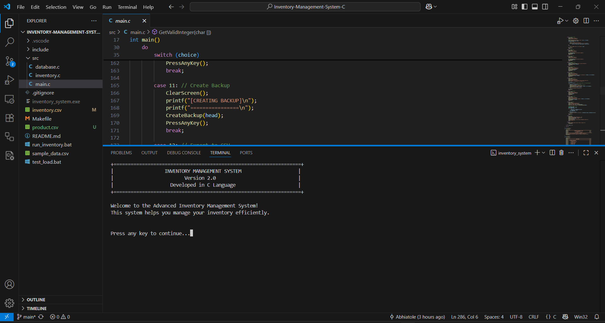
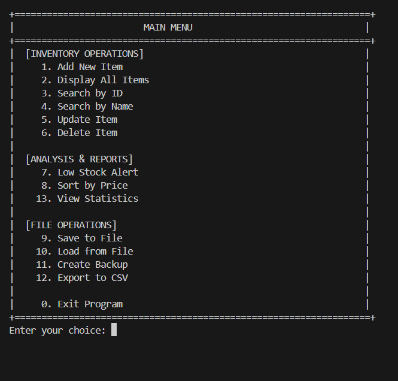
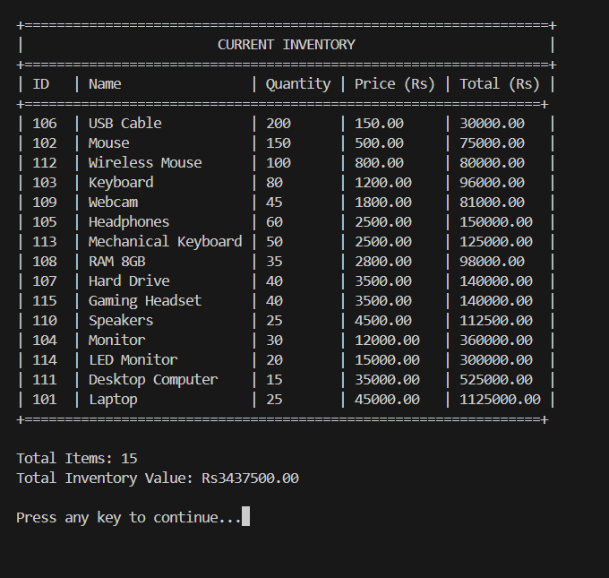
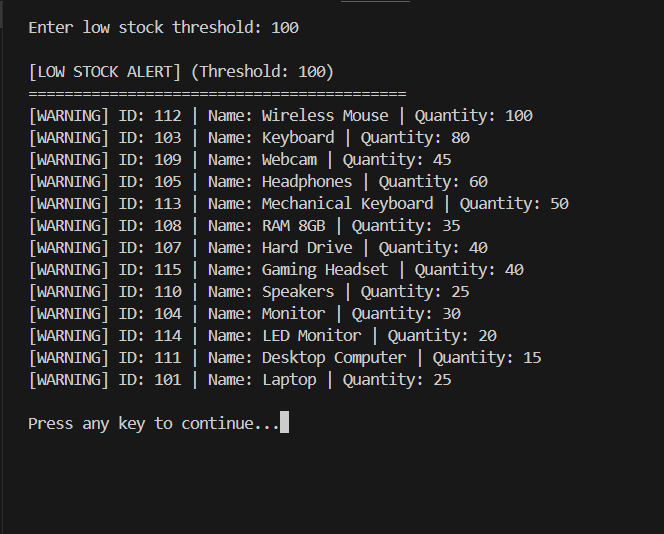
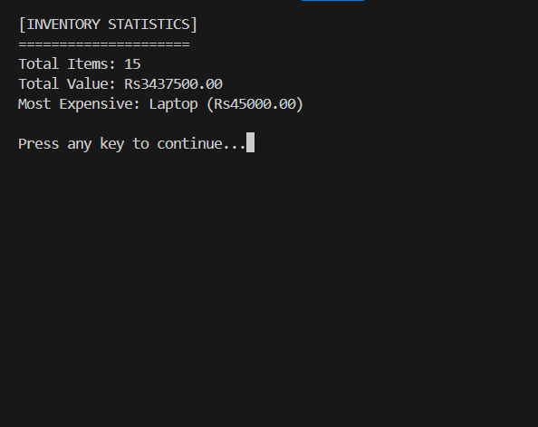
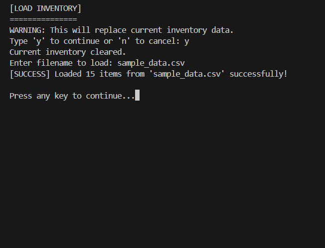
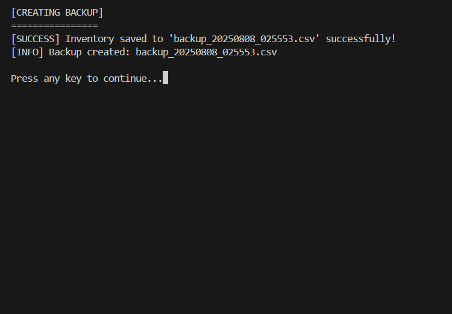
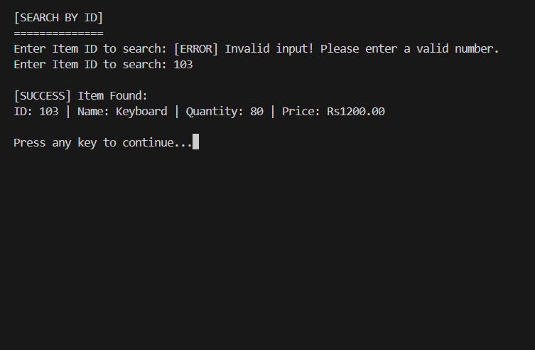
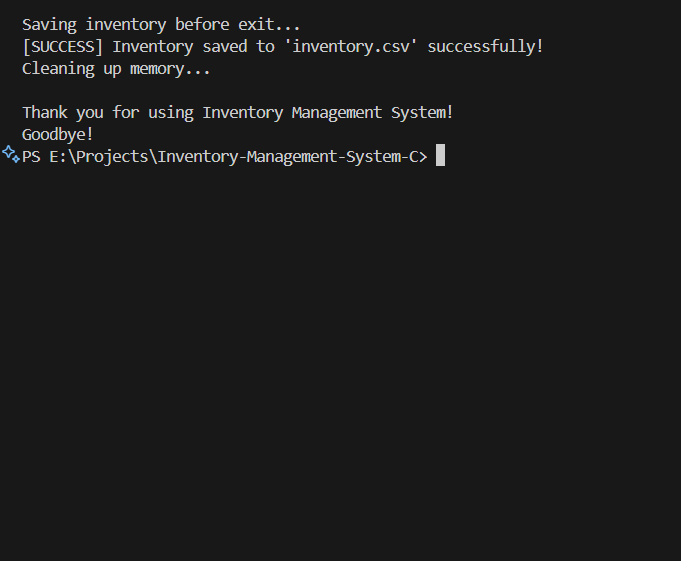

# 🗃️ Inventory Management System in C

<div align="center">


**A robust, feature-rich Inventory & Stock Management System written in C**

*Perfect for learning advanced data structures, file handling, and system design*

[🚀 Quick Start](#-quick-start) • [📸 Screenshots](#-system-screenshots) • [🛠️ Features](#-features) • [📖 Documentation](#-technical-implementation)

</div>

---

## 📋 Table of Contents

- [📸 System Screenshots](#-system-screenshots)
- [🚀 Features](#-features)
- [🏗️ Project Structure](#️-project-structure)
- [🛠️ Technical Implementation](#️-technical-implementation)
- [⚡ Quick Start](#-quick-start)
- [💡 Usage Guide](#-usage-guide)
- [🧪 Sample Data](#-sample-data)
- [🎯 Learning Objectives](#-learning-objectives)
- [🚧 Future Enhancements](#-future-enhancements)
- [🤝 Contributing](#-contributing)

---

## 📸 **System Screenshots**

### 🖥️ **Main Interface & Navigation**
<table>
<tr>
<td width="50%">


<sub><b>Main Menu Interface</b><br/>Professional menu with 13 comprehensive operations</sub>

</td>
<td width="50%">


<sub><b>Menu Navigation System</b><br/>Interactive options for all inventory operations</sub>

</td>
</tr>
</table>

### 📦 **Core Operations**
<table>
<tr>
<td width="50%">


<sub><b>Display All Items</b><br/>Complete inventory listing with formatted table view</sub>

</td>
<td width="50%">


<sub><b>Low Stock Alert System</b><br/>Configurable threshold warnings for monitoring</sub>

</td>
</tr>
</table>

### 📊 **Analytics & Reports**
<div align="center">


<sub><b>Inventory Statistics & Analysis</b><br/>Comprehensive reporting with total value, item counts, and financial insights</sub>

</div>

### 💾 **Data Management**
<table>
<tr>
<td width="50%">


<sub><b>Load from CSV File</b><br/>Import inventory items with data validation</sub>

</td>
<td width="50%">


<sub><b>Create Backup</b><br/>Generate timestamped backup of current data</sub>

</td>
</tr>
</table>

### 🔍 **Search & Save Operations**
<table>
<tr>
<td width="50%">


<sub><b>Search by ID</b><br/>Quick item lookup with detailed results</sub>

</td>
<td width="50%">


<sub><b>Save & Exit Program</b><br/>Persistent data storage with auto-save</sub>

</td>
</tr>
</table>

---

## 🚀 **Features**

<table>
<tr>
<td width="50%">

### 📦 **Core Operations**
- ✅ **CRUD Operations** - Add, Read, Update, Delete items
- 🔍 **Advanced Search** - Search by ID or name
- 📊 **Display Management** - Formatted tables with totals
- 🔄 **Update Items** - Modify name, quantity, or price
- ❌ **Delete Items** - Safe removal with confirmation

### 💾 **Data Management**
- 📁 **File I/O Operations** - Save/load inventory data
- 📤 **CSV Import/Export** - Industry-standard format
- 💾 **Auto-save** - Persistent data on exit
- 🔄 **Backup System** - Timestamped backups
- 🛡️ **Data Validation** - Input error prevention

</td>
<td width="50%">

### 📊 **Analysis & Reporting**
- 📈 **Inventory Statistics** - Total value & item counts
- 💰 **Financial Analysis** - Most expensive items
- ⚠️ **Low Stock Alerts** - Configurable thresholds
- 📊 **Sorting Options** - Sort by price (asc/desc)
- 📋 **Comprehensive Reports** - Detailed analytics

### 🎨 **User Experience**
- 🖥️ **Professional CLI** - Beautiful ASCII interface
- ✅ **Input Validation** - Robust error handling
- 📱 **Menu-driven UI** - Intuitive navigation
- 🚀 **Fast Performance** - Efficient linked lists
- 🔧 **Cross-platform** - Windows, Linux, macOS

</td>
</tr>
</table>

---

## 🏗️ **Project Structure**

```
📦 Inventory-Management-System-C/
├── 📂 src/                    # Source code files
│   ├── 📄 main.c             # Main program with UI and menu system
│   ├── 📄 inventory.c        # Core inventory operations (CRUD, search, sort)
│   └── 📄 database.c         # File I/O operations and data persistence
├── 📂 include/               # Header files
│   ├── 📄 inventory.h        # Inventory function prototypes and structures
│   └── 📄 database.h         # Database function prototypes
├── 📂 images/                # System screenshots
│   ├── 🖼️ 01.png            # Main menu interface
│   ├── 🖼️ 02.png            # Menu navigation system
│   ├── 🖼️ 03.png            # Display all inventory items
│   ├── 🖼️ 04.png            # Low stock alert system
│   ├── 🖼️ 05.png            # Inventory statistics & analysis
│   ├── 🖼️ 06.png            # Load inventory from CSV file
│   ├── 🖼️ 07.png            # Create backup functionality
│   ├── 🖼️ 08.png            # Search inventory by ID
│   └── 🖼️ 09.png            # Save inventory and exit program
├── 📂 .vscode/              # VS Code configuration
├── 📄 .gitignore            # Git ignore rules
├── 📄 Makefile              # Build configuration and compilation rules
├── 📄 run_inventory.bat     # Windows execution script
├── 📄 sample_data.csv       # Sample test dataset
├── 📄 test_data.csv         # Clean test data
└── 📄 README.md             # Project documentation
```

---

## 🛠️ **Technical Implementation**

<table>
<tr>
<td width="50%">

### 🔧 **Core Technologies**
- **Language**: C (C99 standard)
- **Compiler**: GCC with strict warnings
- **Platform**: Cross-platform compatibility
- **Memory**: Dynamic allocation & cleanup
- **File Format**: CSV for data persistence

### 📊 **Data Structures**
- **Singly Linked List**: Dynamic inventory storage
- **Custom Structures**: NODE type for items
- **Pointer Management**: Advanced manipulation
- **Memory Safety**: Proper allocation/deallocation

</td>
<td width="50%">

### ⚡ **Key Algorithms**
- **Search**: Linear search by ID and name
- **Sorting**: Bubble sort by price
- **File Parsing**: Robust CSV handling
- **Input Validation**: Comprehensive error checking
- **Memory Management**: Leak prevention

### 🏗️ **Architecture**
- **Modular Design**: Separated concerns
- **Header Files**: Clean API definitions
- **Error Handling**: Robust validation
- **User Interface**: Professional CLI design

</td>
</tr>
</table>

---

## ⚡ **Quick Start**

### 🔧 **Prerequisites**
```bash
✅ GCC compiler (4.9 or later)
✅ Windows/Linux/macOS operating system  
✅ 50MB free disk space
✅ Terminal/Command prompt access
```

### 📥 **Installation & Setup**

```bash
# 1️⃣ Clone the repository
git clone https://github.com/Abhishek-Atole/Inventory-Management-System-C.git
cd Inventory-Management-System-C

# 2️⃣ Compile using GCC
gcc -Wall -Wextra -std=c99 -Iinclude src/main.c src/inventory.c src/database.c -o inventory_system

# 3️⃣ Run the program
./inventory_system                    # Linux/macOS
inventory_system.exe                  # Windows
# OR
run_inventory.bat                     # Windows batch file
```

### 🔨 **Using Makefile**
```bash
make all        # Build the project
make clean      # Clean build artifacts  
make debug      # Debug build with extra flags
make run        # Build and run
```

---

## 💡 **Usage Guide**

### 🎯 **Step-by-Step Operations

| Operation | Menu Option | Screenshot | Description |
|-----------|-------------|------------|-------------|
| **🏠 Main Menu** | Start Program | [Image 01](#-system-screenshots) & [Image 02](#-system-screenshots) | Access all 13 operations |
| **📦 View Items** | Option 2 | [Image 03](#-system-screenshots) | Display complete inventory |
| **📊 Check Statistics** | Option 13 | [Image 05](#-system-screenshots) | View comprehensive analytics |
| **⚠️ Low Stock** | Option 7 | [Image 04](#-system-screenshots) | Monitor stock levels |
| **📁 Load Data** | Option 10 | [Image 06](#-system-screenshots) | Import from CSV files |
| **💾 Create Backup** | Option 11 | [Image 07](#-system-screenshots) | Generate timestamped backups |
| **🔍 Search Items** | Option 3 | [Image 08](#-system-screenshots) | Find items by ID |
| **💾 Save & Exit** | Option 0 | [Image 09](#-system-screenshots) | Auto-save and close |

### 🚀 **Quick Actions**
```bash
# Load sample data on first run
Choose Option 10 → Enter "sample_data.csv"

# Check low stock items  
Choose Option 7 → Enter threshold (e.g., 50)

# View all statistics
Choose Option 13 → View comprehensive report

# Create backup before major changes
Choose Option 11 → Timestamped backup created
```

---

## 🧪 **Sample Data**

The system includes comprehensive test datasets:

### 📄 **sample_data.csv**
```csv
ID,Name,Quantity,Price
101,Laptop,25,45000.00
102,Mouse,150,500.00
103,Keyboard,80,1200.00
104,Monitor,30,12000.00
105,RAM,60,2500.00
```

### 📊 **Data Categories**
- **💻 Electronics**: Laptops, Monitors, Peripherals
- **🔧 Components**: RAM, Storage, Cables  
- **📱 Accessories**: Mice, Keyboards, Webcams

---

## 🎯 **Learning Objectives**

<table>
<tr>
<td width="50%">

### 📚 **Data Structures Concepts**
- ✅ **Linked Lists** - Implementation & manipulation
- ✅ **Pointers** - Advanced usage and double pointers
- ✅ **Structures** - Custom data types and organization
- ✅ **Memory Management** - Dynamic allocation/deallocation
- ✅ **Arrays** - String handling and manipulation

</td>
<td width="50%">

### 🔧 **Programming Skills**
- ✅ **File I/O** - Reading, writing, CSV parsing
- ✅ **Error Handling** - Robust validation and recovery
- ✅ **Modular Design** - Separation of concerns
- ✅ **User Interface** - Console-based application design
- ✅ **Algorithms** - Search, sort, and data processing

</td>
</tr>
</table>

---

## 🚧 **Future Enhancements**

### 🔮 **Planned Features**
- 🗄️ **Database Integration** - SQLite support for larger datasets
- 🔐 **User Authentication** - Multi-user access with roles
- 📊 **Advanced Analytics** - Charts, graphs, and trend analysis
- 🌐 **Web Interface** - Browser-based dashboard
- 📱 **Mobile App** - Cross-platform mobile companion
- 🔄 **Real-time Sync** - Cloud synchronization capabilities
- 📧 **Email Alerts** - Automated low-stock notifications
- 🏷️ **Barcode Support** - Scanner integration for easy input

### 🎯 **Enhancement Roadmap**


---

## 🤝 **Contributing**

We welcome contributions! Here's how you can help:

### 🔧 **How to Contribute**
1. 🍴 **Fork** the repository
2. 🌿 **Create** your feature branch (`git checkout -b feature/AmazingFeature`)
3. ✅ **Commit** your changes (`git commit -m 'Add some AmazingFeature'`)
4. 🚀 **Push** to the branch (`git push origin feature/AmazingFeature`)
5. 📋 **Open** a Pull Request

### 🐛 **Reporting Issues**
Found a bug? Please create an issue with:
- 📝 Clear description of the problem
- 🔄 Steps to reproduce
- 💻 Your system information
- 📸 Screenshots if applicable

---

## 📄 **License**

This project is licensed under the **MIT License** - see the [LICENSE](LICENSE) file for details.

---

## 🙏 **Acknowledgments**

<div align="center">

**Special thanks to:**
- 👥 **C Programming Community** - For inspiration and guidance
- 🌟 **Open Source Contributors** - For valuable feedback
- 📚 **Data Structures Resources** - For educational foundation
- 🏫 **Academic Institutions** - For promoting practical learning

</div>

---

## 📞 **Contact & Links**

<div align="center">

**🔗 Project Repository**: [Inventory-Management-System-C](https://github.com/Abhishek-Atole/Inventory-Management-System-C)

**👨‍💻 Developer**: [Abhishek Atole](https://github.com/Abhishek-Atole)

---

### 🌟 **Show Your Support**

**If you found this project helpful, please consider giving it a star!**

[](https://github.com/Abhishek-Atole/Inventory-Management-System-C)

**Happy Coding! 🚀**

</div>

---

<div align="center">

*Built with ❤️ using C Programming Language*

*Perfect for learning • Production Ready • Open Source*

</div>